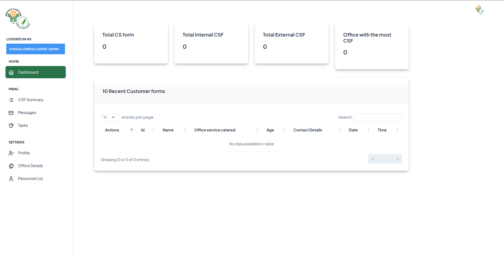
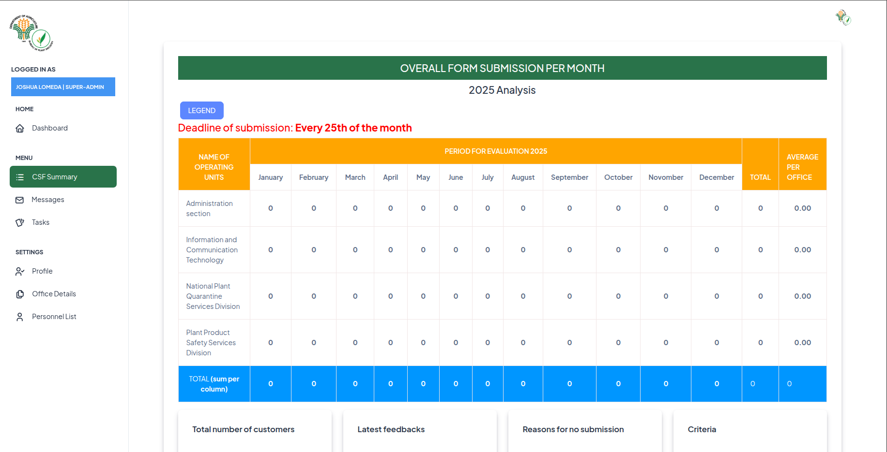
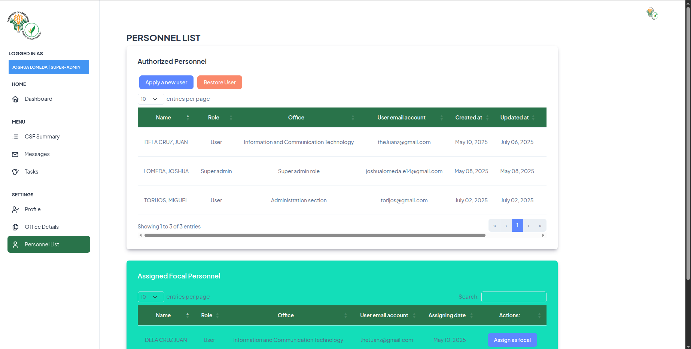
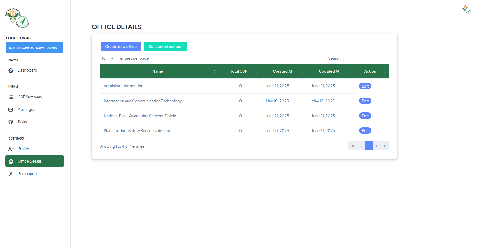

<h1 align="center"> Customer Satisfaction Summary web application</h1>
<h3 align="left">About</h3>

Part of the digitalization project effort by the Information and Computer Section of the Bureau of Plant Industry that aims to digitalize the Customer and Satisfaction reports summary. 
The web based application will provide summary reports and documentation to be submitted to the Planning section for Evaluation.
Overall  service performance and satisfaction. Further documentation and notes will be written as the project progress along the development.

### System dashboard

### Report submission

### Personnel settings

### Office department settings

