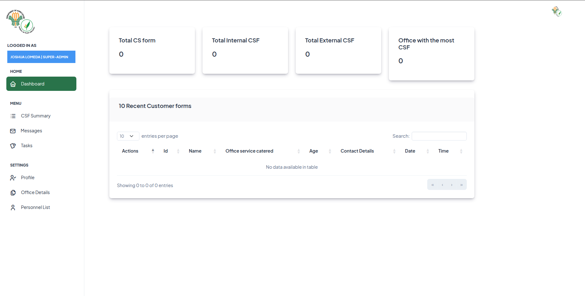
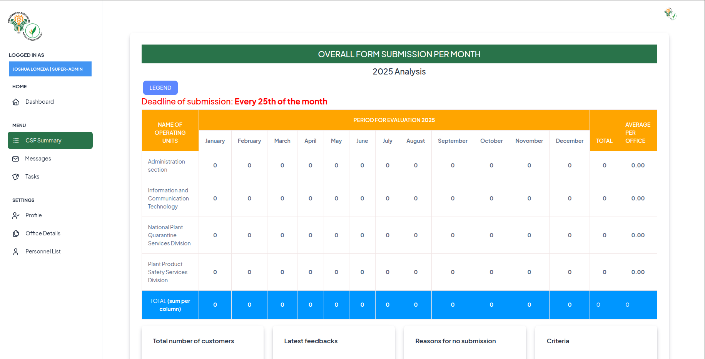
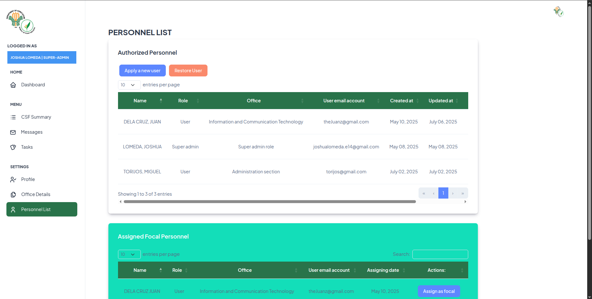
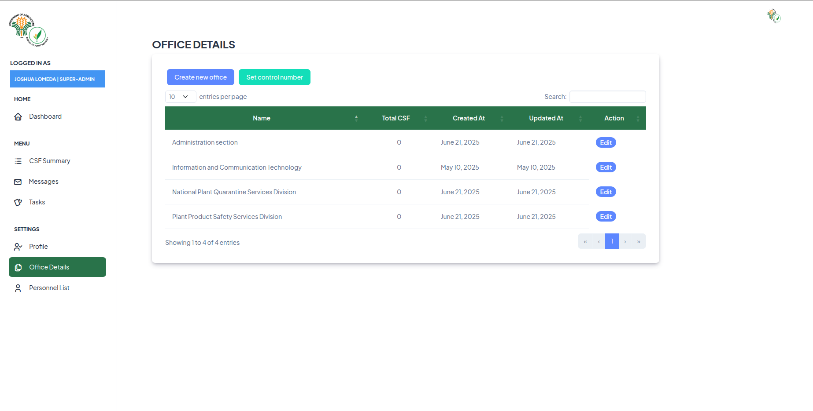

<h2 align="center">📊 Customer Satisfaction Summary Web Application</h2>

<h3>💡 About the Project</h3>

This project is part of the digital transformation initiative of the Information and Computer Section at the Bureau of Plant Industry (BPI).

The system was developed to replace manual, paper-based customer satisfaction reporting with a centralized web-based application. It enables efficient collection, consolidation, and generation of summary reports for submission to the Planning Section for evaluation and performance assessment.

The platform helps monitor overall service performance and customer satisfaction metrics across departments.

---

<h3>🚀 Key Features</h3>

- Automated summary report generation
- Digital submission of customer satisfaction forms
- Role-Based Access Control (RBAC)
- Department and office management modules
- Dashboard with performance insights
- Structured data storage for evaluation and documentation

---

<h3>🖥️ System Preview</h3>

### 📊 System Dashboard

### 📝 Report Submission Module

### 👥 Personnel Management

### 🏢 Office & Department Management

---

<h3>🛠️ Tech Stack</h3>

- ⚙️ Backend: Laravel (PHP)
- 🗄️ Database: MySQL
- 🎨 Frontend: Blade Templates, JavaScript
- 🔐 Authentication & RBAC Implementation

---

<h3>📌 Purpose</h3>

The goal of this system is to:

- Improve reporting efficiency
- Reduce manual errors
- Enhance data accessibility
- Provide actionable insights for internal evaluation
- Support data-driven decision-making within the agency

---

<h3>📈 Project Status</h3>

🟡 Prototype / Deployed (Internal Government Use)

Further enhancements and documentation will be added as development progresses.
